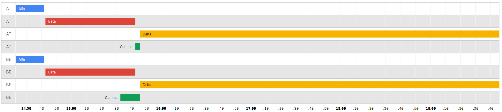
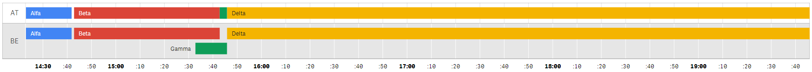

# [Qlik Sense](https://www.qlik.com/us/products/qlik-sense) Reboot Timeline

##  Screenshots

Timeline with each bar on own line:

Timeline with grouped bars into one line based on first dimension:

## Usage

Dimensions:

- Dimension 1 (required): Main dimension and row label
- Dimension 2 (optional): Bar label
- Dimension 3 (required): Start datetime
- Dimension 4 (required): End datetime

Measures:
There is no measure.

DateFormats:

- Dates require to be in the standard ISO format:
    - YYYY-MM-DD just the date
    - YYYY-MM-DD hh:mm{:ss} full date with time (seconds are optional)

## Front-End Configuration
Appearance Settings:

- General: standard Qlik Sesnse general appearence settings for titles etc
- Show Row Labels: boolean switch -> display or not the label on the left of the chart
- Group Row Labels: boolean switch -> group lines with the same label name (as the second image shows)
- Color Expression: if black you get the standard google timeline chart colors, or you can specify a Qlik sense color expression or even a field containing a hex color string
- Date Format: let you insert the date format (https://en.wikipedia.org/wiki/ISO_8601)

##  Sources

- GitHub: https://github.com/SimoneSilini/Reboot-Timeline
- Qlik Branch: https://developer.qlik.com/garden/5c38a38f1f9bf60010baa65e
- Note please that this solution was created based on these two projects: 
    
    https://github.com/kai/qlik-sense-timeline
    https://github.com/plzaart/multicolored_timeline

##  License

MIT License
